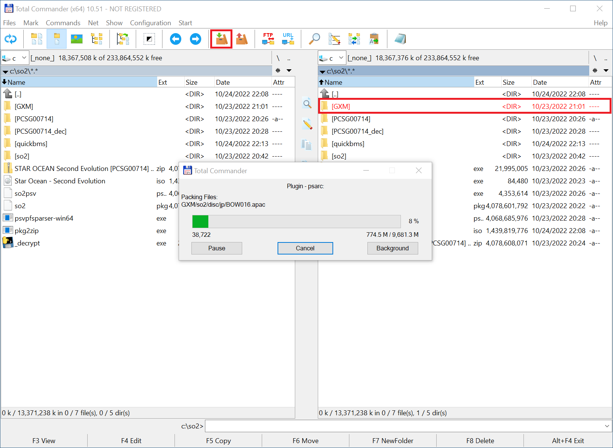

# Star-Ocean-2
An attempt to create an English patch for Star Ocean Second Evolution (Vita).

# Unpacking PSVita Files
1. Download the following tools (as needed):
   - [pkg2zip](https://github.com/mmozeiko/pkg2zip/releases)
   - [_decrypt.exe and psvpfsparser-win64.exe](https://gbatemp.net/threads/release-decrypt-and-launch-psn-store-vita-games-without-plugins.548878/)
   - [Total Commander](https://totalcmd.net/plugring/totalcmd.html)
   - [PSARC plugin for Total Commander](https://totalcmd.net/plugring/PSARC.html)
   - [wxMEdit](https://wxmedit.github.io/downloads.html)
   - [quickbms](http://aluigi.altervista.org/quickbms.htm) to unpack `APAC` files
1. Run this command `pkg2zip.exe so2.pkg` to get `STAR OCEAN Second Evolution [PCSG00714] [JPN].zip`
  
1. Extract the `zip` file.  The contents should look like this
   ```
    \---app
        \---PCSG00714
            |   eboot.bin
            |   so2psv.psarc
            |
            +---GXM
            |   \---save
            |           ClearIcon.png
            |           EmptyIcon.png
            |           SaveIcon.png
            |
            +---sce_module
            |       libc.suprx
            |       libfios2.suprx
            |       libult.suprx
            |
            +---sce_pfs
            |       files.db
            |       pflist
            |       unicv.db
            |
            \---sce_sys
                |   clearsign
                |   icon0.png
                |   keystone
                |   param.sfo
                |   pic0.png
                |
                +---about
                |       right.suprx
                |
                +---livearea
                |   \---contents
                |           bg.png
                |           button.png
                |           template.xml
                |
                +---package
                |       body.bin
                |       head.bin
                |       stat.bin
                |       tail.bin
                |       temp.bin
                |
                \---trophy
                    \---NPWR09638_00
                            TROPHY.TRP
   ```

1. Copy `work.bin` into `PCSG00714\sce_sys\package` and run this command to decrypt files: `_decrypt.exe PCSG00714`
  

1. Unpack `PCSG00714_dec\so2psv.psarc` with [Total Commander](https://totalcmd.net/) and [PSARC Plugin](https://totalcmd.net/plugring/PSARC.html)
  

1. Unpacking `PCSG00714_dec\so2psv.psarc` should get you a folder called `GMX`, see contents here: [so2psv.psarc.txt](so2psv.psarc.txt)

1. Use [`QuickBMS`](http://aluigi.altervista.org/papers/quickbms.zip) with [`star_ocean_kcpa.bms`](http://aluigi.altervista.org/bms/star_ocean_kcpa.bms) to extract `APAC` files.  Sample command to extract a single file: `quickbms.exe -d star_ocean_kcpa.bms 017_ArliaW_20_branch001.apac`
  

1. A hex editor like `wxMEdit` can be used to look at the contents.

# Repacking PSVita Files
1. Use Total Command and the PSARC plugin to pack the files back into a single `PSARC` file
1. Select the `GMX` folder with with the modded files on the right side of Total Commander (right-click to highlight red) 
1. Click on the "Pack file" button on the tool bar.  Uncheck "Also pack pathnames" so the `GMX` folder doesn't appear again.
  
1. Click OK to save the file as `GMX.PSARC`, you can rename it to `so2psv.psarc` later.
1. Notice the newly packed file is a different size from the original, even if you don't make any modifications.


# Unpacking PSP Files
1. Get `PSP_GAME\USRDIR\so2pack.bin`
1. Use QuickBMS with [`so2pack.bms`](scripts/so2pack.bms) to extract game files.  Sample command: `quickbms.exe -d so2pack.bms so2pack.bin`
  
1. After extraction, there should be ~25,830 files with extensions like `DAT`, `IMG`, `GIM`, `NFC`, `SDB`, `SLZ`, `TXT`, `VAP`, and `XEJ`.  See contents here: [so2pack.bin.txt](so2pack.bin.txt)
1. Use QuickBMS again to further extract `SLZ` files.  Sample command: `quickbms.exe -F "{}.slz" slz.bms so2pack.bin_extract slz`
  
1. There are more `SLZ` files in here, so run the command again to extract the files further.  Files include `CGM`, and `FOG` extensions.

# Packing PSP Files
1. Make a copy of `so2pack.bin` just in case.
1. Use QuickBMS to repack files into the existing `so2pack.bin`.  Sample command: `quickbms.exe -r -w so2pack.bms so2pack.bin so2pack.bin_extract`
1. To repack files, the modified files need to be less than or equal to the original file.

# Hacker Notes
This section is for notes found around the web that may help with this project.

## Hacker Note 1
> Note for anyone trying to patch ENG text.  Entire game is one `psarc` file. ~~It's easily extracted and reencrypted.~~ ~~Structure appears same as PSP ver~~, so, ~~I think it is possibly easy to patch official PSP ENG translation~~.

# Resources
  - [QuickBMS script to unpack `so2pack.bin` (PSP)](https://m.blog.naver.com/physics1114/220350384937)
